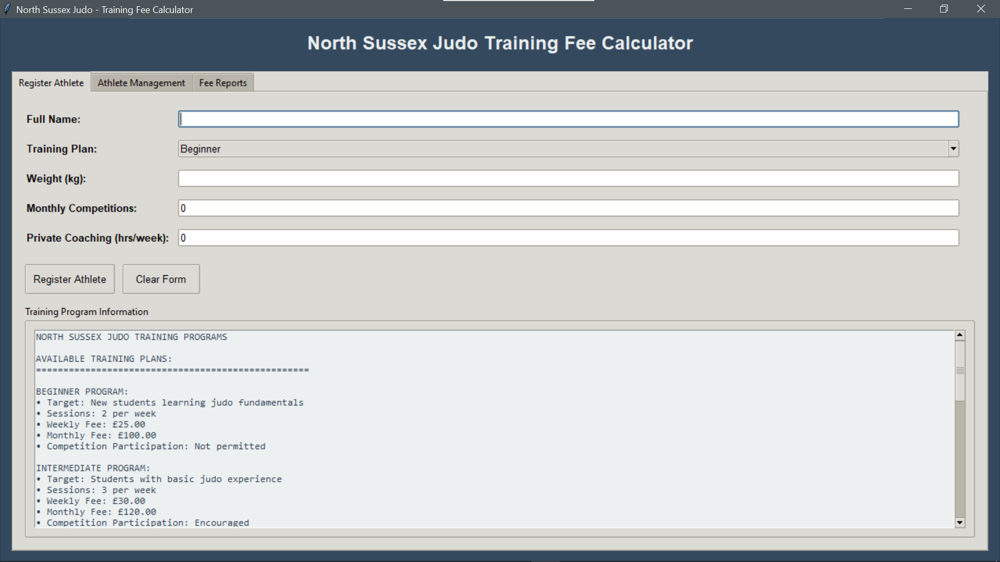
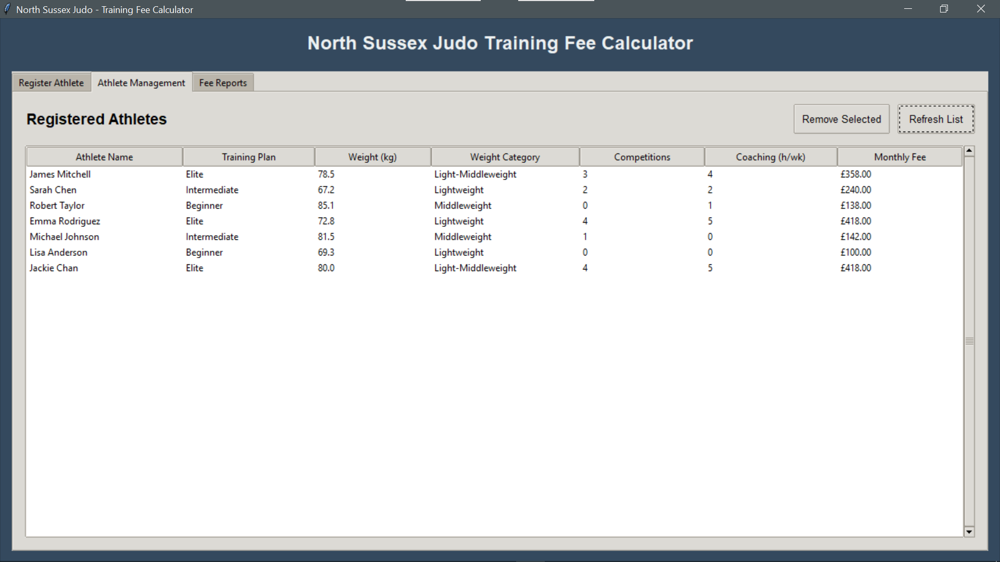
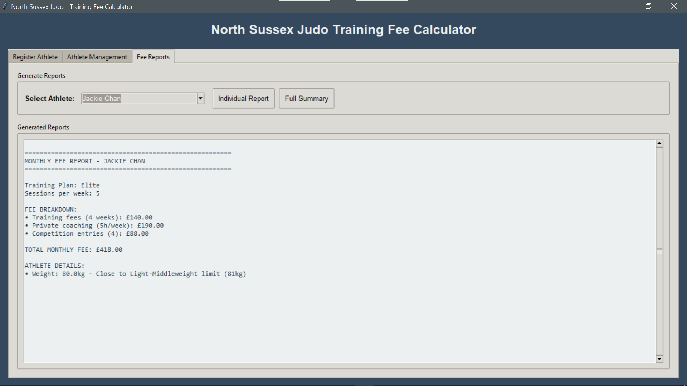

# North Sussex Judo Training Fee Calculator

A desktop application for calculating monthly training fees for judo athletes, built with Python and Tkinter.
This project was created solely as part of a university programming assignment to demonstrate object-oriented, procedural, and event-driven programming paradigms.
It is archived and will not be updated or maintained. Any entities/organizations mentioned in this project are entirely fictional.

[](https://python.org)
[](LICENSE)
[](https://docs.python.org/3/library/tkinter.html)

## Project Status

- **Status**: Archived
- **Purpose**: Portfolio display only
- **Maintenance**: No further changes will be made
- **Contributions**: Pull requests and issues will not be accepted

## Project Overview

This application was developed for North Sussex Judo, a local training facility that provides judo sessions to people of all ages and experience levels. The system calculates monthly training fees based on training plans, private coaching, and competition entries.

## Features

- **Athlete Management**: Register and manage athlete profiles
- **Fee Calculation**: Automated monthly fee calculations with itemized breakdowns
- **Weight Categories**: Automatic weight category classification
- **Competition Tracking**: Support for competition entries (Intermediate/Elite only)
- **Private Coaching**: Track additional coaching hours and costs
- **Comprehensive Reports**: Individual and summary financial reports
- **Modern GUI**: Clean, intuitive user interface with tabbed navigation
- **Data Validation**: Robust input validation and error handling
- **Sample Data**: Pre-loaded with demonstration athletes

## Getting Started

### Prerequisites

- Python 3.8 or higher
- tkinter (usually included with Python)

### Installation

1. **Clone the repository**
   ```bash
   git clone https://github.com/yourusername/north-sussex-judo.git
   cd north-sussex-judo
   ```

2. **Verify Python installation**
   ```bash
   python --version
   ```

3. **Test system compatibility**
   ```bash
   python test_system.py
   ```

4. **Run the application**
   ```bash
   python north_sussex_judo.py
   ```

### Quick Start Guide

1. **Launch the application** - The main window will appear with three tabs
2. **Add Athletes** - Use the "Add New Athlete" tab to register athletes
3. **View Athletes** - Check the "Athlete List" tab to see all registered members
4. **Calculate Fees** - Use the "Fee Calculator" tab for monthly fee reports

## System Requirements

| Component | Requirement |
|-----------|-------------|
| Operating System | Windows 10+, macOS 10.14+, Linux (Ubuntu 18.04+) |
| Python Version | 3.8 or higher |
| RAM | 512 MB minimum |
| Storage | 50 MB available space |
| Display | 900x700 minimum resolution |

## Business Logic

### Training Plans

| Plan | Sessions/Week | Weekly Fee | Monthly Fee | Competition Entry |
|------|---------------|------------|-------------|-------------------|
| Beginner | 2 | £25.00 | £100.00 | ❌ Not Allowed |
| Intermediate | 3 | £30.00 | £120.00 | ✅ Allowed |
| Elite | 5 | £35.00 | £140.00 | ✅ Allowed |

### Additional Services

- **Private Coaching**: £9.50 per hour (maximum 5 hours/week)
- **Competition Entry**: £22.00 per competition
- **Weight Categories**: 6 official categories (Flyweight to Heavyweight)

### Calculation Rules

- Month = 4 weeks for fee calculations
- Only Intermediate and Elite athletes can enter competitions
- Maximum 4 competitions per month
- All currencies displayed to 2 decimal places

## Technical Architecture

### Programming Paradigms

This project demonstrates three core programming paradigms:

#### Object-Oriented Programming
- **`Athlete` Class**: Encapsulates athlete data and behaviors
- **Data Encapsulation**: Private attributes with property accessors
- **Method Organization**: Logical grouping of related functionality
- **Inheritance Ready**: Extensible design for future enhancements

#### Procedural Programming
- **Utility Functions**: Currency formatting, input validation
- **Modular Design**: Reusable functions with clear input/output
- **Algorithm Implementation**: Step-by-step fee calculation processes

#### Event-Driven Programming
- **GUI Framework**: Complete tkinter-based interface
- **Event Handlers**: User interaction callbacks
- **Asynchronous Processing**: Responsive interface design

### Project Structure

```
north-sussex-judo/
├── north_sussex_judo.py          # Main application
├── debug_north_sussex_judo.py    # Debug version with enhanced logging
├── test_system.py                # System compatibility checker
├── requirements.txt              # Python dependencies
├── README.md                     # Project documentation
├── LICENSE                       # MIT License
├── docs/                         # Documentation
│   ├── user_guide.md            # User manual
│   ├── technical_specification.md
│   └── algorithm_analysis.md
├── screenshots/                  # Application screenshots
│   ├── main_interface.png
│   ├── athlete_management.png
│   └── fee_calculation.png
└── tests/                        # Unit tests
    └── test_athlete.py
```

## Code Quality

- **PEP 8 Compliance**: Follows Python style guidelines
- **Type Hints**: Enhanced code documentation and IDE support
- **Comprehensive Documentation**: Detailed docstrings and comments
- **Error Handling**: Robust exception handling and user feedback
- **Input Validation**: Comprehensive data validation
- **Modular Design**: Clean separation of concerns

## Screenshots

### Main Interface

*Clean, professional interface with tabbed navigation*

### Athlete Management

*Comprehensive athlete registration and management*

### Fee Calculation

*Detailed fee calculations and reporting*

### Development Setup

1. Fork the repository
2. Create a feature branch (`git checkout -b feature/AmazingFeature`)
3. Commit your changes (`git commit -m 'Add some AmazingFeature'`)
4. Push to the branch (`git push origin feature/AmazingFeature`)
5. Open a Pull Request

## License

This project is licensed under the MIT License - see the [LICENSE](LICENSE) file for details.

## Author

**Muhammad Omer Hussain**
- GitHub: [@parsecsion](https://github.com/parsecsion)
- Email: muhammad.omer1021@gmail.com

## Known Issues

- None currently reported

## Support

If you encounter any issues or have questions:
1. Check the [Issues](https://github.com/yourusername/north-sussex-judo/issues) page
2. Create a new issue with detailed description
3. Contact the author directly

---

**If you found this project helpful, please consider giving it a star!**
